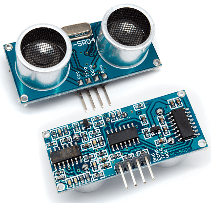
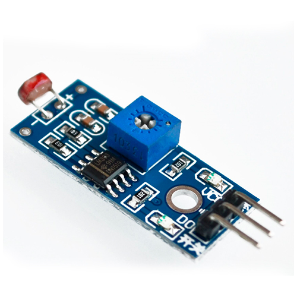
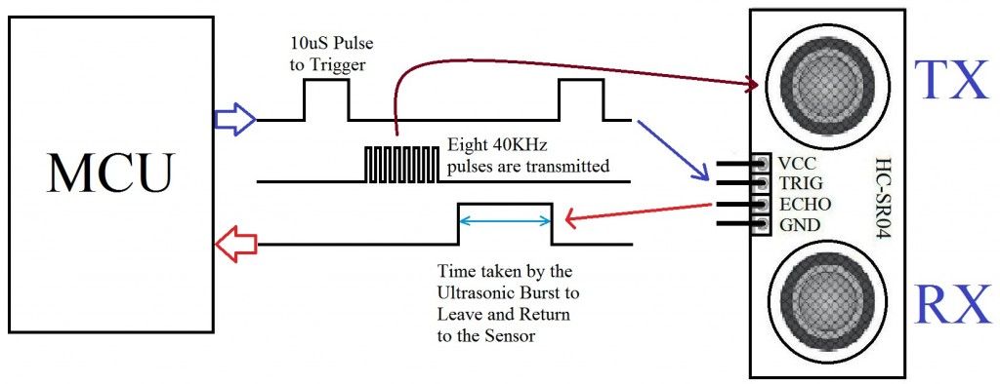
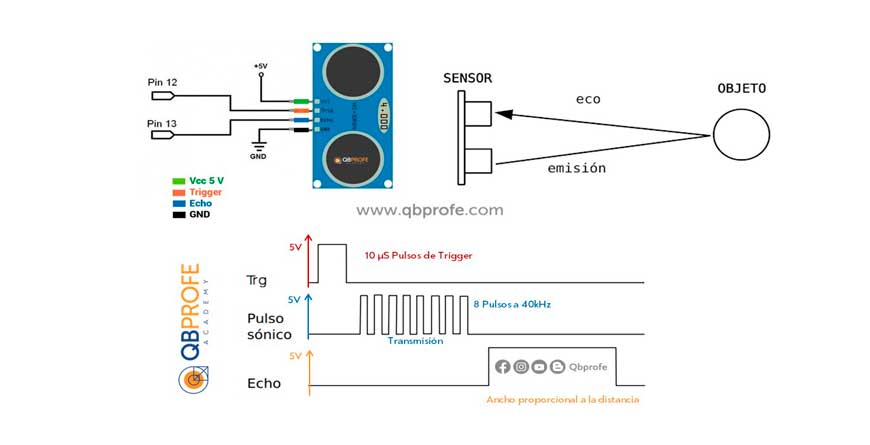
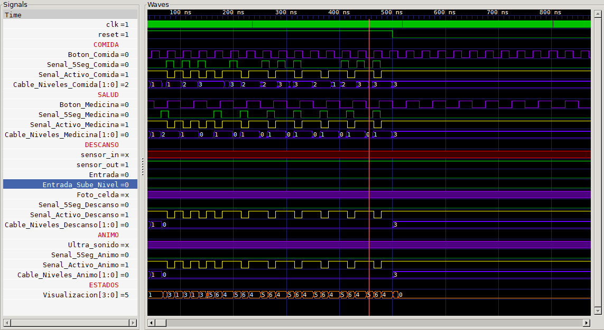
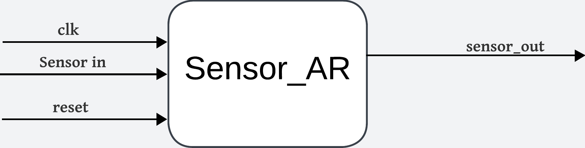
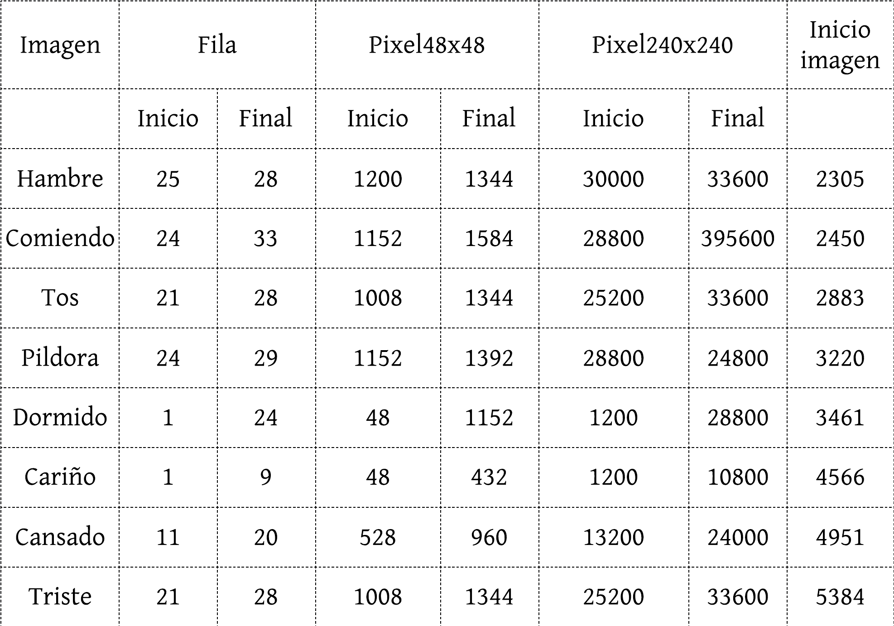
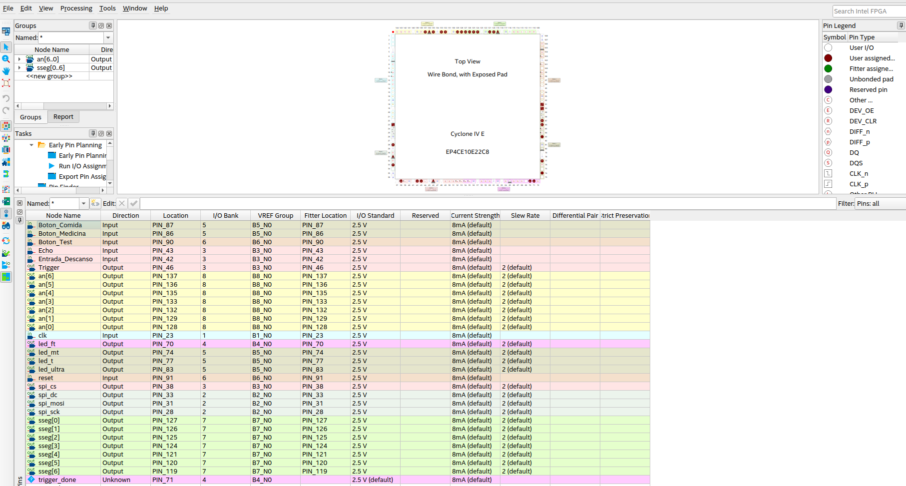

# Entrega del proyecto Tamagotchi `Eris` 
- Stewart Andres Antolinez Zapata `santolinez@unal.edu.co` 
- Natalia Andrea Dueñas Salamanca `nduenass@unal.edu.co`
- Juan Diego Saenz Ardila `jsaenza@unal.edu.co` 


## Introducción 

En el proyecto final del curso de Electrónica Digital 1, se presenta la culminación del proceso de aprendizaje a través de la integración de los fundamentos y aplicaciones avanzadas de la electrónica digital. Se ponen en práctica conceptos clave como la representación de datos, la lógica combinacional y secuencial, las máquinas de estado algorítmico, las unidades de control y el datapath, ademas del uso adecuado de herramientas de sintetización y simulación ademas de conocer a detalle el funcionamiento y desarrollar la habilidad de adaptarse a las problematicas como lo es la logica negada que se encuentea en la Tarjeta de desarrollo con la FPGA siendo esa la razon de poseer la adquirir la habilidad de desarrollar simulaciones teniendo presente este aspecto tan relevante.

El objetivo principal de este proyecto es aplicar todos estos conocimientos en el diseño y creación de una mascota virtual, el `"Tamagotchi"`, que simula el cuidado de una mascota real. Para lograr esto, se utilizan entradas como sensores, botones y otros dispositivos que modifican el comportamiento de la mascota virtual. Estos cambios se reflejan mediante salidas visuales que muestran detalles de los aspectos principales del `"Tamagotchi"`, tales como su ánimo, salud, descanso y cantidad de comida. La visualización de estos aspectos se realiza mediante LEDs, displays y una pantalla, lo que permite una interacción más dinámica y clara con el estado de la mascota.


|Componente|Referencia|Imagen|Funcionalidad|
|--|--|--|--|
|FPGA | Ciclones IV EP4CE10E22C8N| | Brindar todos los componentes logicos para la descripción de hardware realizada | 
|Tarjeta de desarrollo| A-C4E6||Conexion de entradas y salidas del tamagotchi|
|Botones|B0D178CN81||Entrada de pulsadores con el cual modificar el funcionamiento del tamagotchi|
|Sensor Ultra Sonido|HC-SR04||Detección de un objeto a una distancia aproximadamente menor a 20 cm para modificar el Nivel Animo|
|Sensor de Luz|LDR Fotoresistor|| Detecciíon de determinada ausencia de luz con el fin de modificar el Nivel Descanso|
|Pantalla|ILI9341|| Visualización de la mascota virtual permitiendo conocer su estado, necesidades e interacción en el momento
|Displays 7 segmentos|Anodo Comun|| Permite la visualizacion de detalles mas especificos del estado de la mascota virtual como lo es el nivel de sus modos, el estado en el que se encuentra y el contador Test


## Componentes de Interacción
**Botones**
* `Reset`: Para restablecer el Tamagotchi a un estado inicial conocido, simplemente mantén pulsado el botón durante al menos 5 segundos. Este estado inicial simula el despertar de la mascota con salud óptima. El botón necesario para realizar esta acción se encuentra en la tarjeta de desarrollo de la FPGA.

* `Test`: Activa el modo de prueba al mantener pulsado por al menos 5 segundos, permitiendo al usuario navegar entre los diferentes estados del Tamagotchi con cada pulsación. Este sera un boton de la tarjeta de desarrollo de la FPGA.

* `Boton_Comida`: al presionar el botón destinado para cuidar la alimentación del tamagotchi. Cada vez que lo hagas, el nivel de comida aumentará en 1 (si no está en el nivel máximo). Además, durante los siguientes 5 segundos, verás una visualización especial: si tu Tamagotchi está hambriento o desnutrido, aparecerá una imagen que representa que está comiendo.

* `Boton_Medicina`: al presionar el botón destinado para cuidar la salud del tamagotchi. Cada vez que lo hagas, el nivel de salud aumentará en 1 (si no está en el nivel máximo). Además, durante los siguientes 5 segundos, verás una visualización especial: si tu Tamagotchi está en los estados de tos o fiebre, aparecerá una imagen que representa que está recibiendo una píldora para mejorar su salud. 


**Sensores**
* `Sensor Ultra sonido`: Utiliza el sensor de ultrasonido HC-SR04. Cuando este sensor detecte algo a una distancia menor a un umbral determinado, aumentará el nivel de ánimo de la mascota virtual. Además, durante el tiempo en que el sensor esté activo y detectando objetos cercanos, verás una visualización específica en la pantalla. Pero eso no es todo: si el Tamagotchi se encuentra en los estados de tristeza o depresión, cuando la señal del sensor sea 1, verás una imagen que representa al Tamagotchi recibiendo cariño. Si esta señal persiste durante 2.5 segundos o más, el nivel de cariño subirá en 1 (a menos que ya esté en el nivel máximo).







* `Sensor de Luz`: cuando este sensor detecte sombra o una determinada ausencia de luz aumenta el nivel de decanso, y durante el tiempo que que el sensor este registrando esa ausencia de luz este mostrara una visualización determinada para ese caso. Modulo Sensor De Luz Con Ldr Fotoresistor.


## Componentes de Visualización

* `Pantalla ILI9341`: 
El componente ILI9341 es una pantalla TFT que se utiliza en el proyecto para mostrar los distintos estados del Tamagotchi. Cada vez que el Tamagotchi cambia de estado, la pantalla ILI9341 actualiza su visualización para reflejar estos cambios, proporcionando una interfaz gráfica interactiva que mejora la experiencia del usuario con el juego. Esta visualización dinámica permite a los jugadores observar el estado actual del Tamagotchi, facilitando una interacción más inmersiva y efectiva con el juego.


## Visualización de estados


|Estado|Imagenes|Detalles|
|--|--|--|
|Ideal||Todos los niveles se encuentran en su puntuación maxima la cual es 3|
|Hambre y  Desnutrición||El Nivel de Comida se encuntra menor a 3|
|Comiendo||Se pulso el boton de dar comida|
|Tos||El Nivel de Salud se encuentra menor a 3|
|Pildora||Se pulso el boton de dar medicina|
|Cansado||El Nivel de Descanso se encuentra menor a 3|
|Dormido||El Sensor de Luz detecto ausencia luminica por aproximadamente 2.5 segundos|
|Triste||En Nivel de Animo se encuentra menor a 3|
|Carisia||El Sensor Ultra Sonido detecto algo menor a 10 cm por aproximadamente 2.5 segundos|


# Caja Negra


# Máquina de Estados


La máquina de estados finitos parte desde un estado IDLE, donde recibe información de todos los sensores y botones. Si el nivel de cualquier modo baja a 2, va al estado correspondiente a ese nivel (el orden de prioridad es: comida, salud, descanso y ánimo). Es necesario aclarar que estos estados tienen 3 estados internos que serán explicados en la máquina de estados finitos de forma más detallada (según el estado, el parámetro de visualización que será entregado). La única forma de volver a IDLE sin el reset o el test es volviendo a tener un nivel igual a 3 en ese estado.


Observando cada uno de los estados generales, se compone de 3 estados: uno transitorio, que se activa al utilizar el sensor o botón del respectivo estado, y los otros 2 dependen del nivel. En el estado donde el nivel es 0 se había considerado una visualización distinta; sin embargo, debido a los recursos de la FPGA, esta opción fue descartada. Cada estado transitorio se mantendrá durante 5 segundos, para luego cambiar al estado correspondiente según el nuevo nivel.

En esta forma específica, se muestra que el botón de prueba (test) también controla el comportamiento. Este se mueve entre cada uno de los estados internos para después volver a IDLE. A través del registro cambio_test, cambiará a otros 3 estados distintos al ser presionado, siempre que previamente ya se haya activado el modo de prueba (test) pulsándolo durante 5 segundos.


## Descripción de Hardware de la Máquina de estados

La máquina de estados implementada se utiliza principalmente para cambiar entre los diferentes modos del Tamagotchi, permitiendo que dichos cambios sean visibles mediante la representación de los niveles e imágenes que reflejan el estado actual de la mascota virtual. De esta manera, se controlan las acciones permitidas o no en cada estado.

El funcionamiento de la máquina de estados se compone de dos partes fundamentales: la **lógica combinacional** y la **lógica secuencial**, las cuales se pueden observar en los siguientes ejemplos presentes en [Máquina de Estados](Codigos/Codigo_FPGA/Maquina_Estados_1.v).

A continuación, presentamos la organización de los estados que fueron implementados. Sin embargo, es importante destacar que el estado de "muerte" no fue incluido debido a la falta de recursos lógicos.

```verilog

localparam Estado_IDLE       = 4'b0000; // PERFECTO 0

localparam Estado_Hambre     = 4'b0001; // COMIDA   1
localparam Estado_Desnutrido = 4'b0010; // COMIDA   2
localparam Estado_Comiendo   = 4'b0011; // COMIDA   3

localparam Estado_Tos        = 4'b0100; // SALUD    4
localparam Estado_Fiebre     = 4'b0101; // SALUD    5
localparam Estado_Pildora    = 4'b0110; // SALUD    6

localparam Estado_Cansado    = 4'b0111; // DESCANSO 7
localparam Estado_Desvelo    = 4'b1000; // DESCANSO 8
localparam Estado_Dormido    = 4'b1001; // DESCANSO 9

localparam Estado_Triste     = 4'b1010; // ANIMO    10
localparam Estado_Depresion  = 4'b1011; // ANIMO    11
localparam Estado_Carisia    = 4'b1100; // ANIMO    12

localparam Estado_Muerte     = 4'b1101; //GAME OVER

```

Como se puede observar en el siguiente fragmento, la lógica combinacional implementada da prioridad a los estados de la siguiente manera: primero, el estado de **hambre**, relacionado con la comida; luego, el estado de **tos**, relacionado con la salud; después, el estado de **cansancio**, relacionado con el descanso; y finalmente, con la prioridad más baja, el estado de **tristeza**, relacionado con el ánimo de nuestra mascota virtual.

Esta lógica se logró mediante la configuración de parámetros importantes, como el valor de la señal `_Senal_Mtest_`, que puede estar en 1 o 0. Dependiendo de este valor, se evalúa si el nivel es inferior a 3 o si el botón de prueba (Test) fue pulsado y su contador se encuentra dentro de alguno de los valores predefinidos.

Gracias a esta combinación de condiciones y al cumplimiento de los parámetros establecidos, la mascota virtual permanecerá en el mismo estado o cambiará de estado según la información que llegue a `_Estado_Siguiente_`. Esto permite la navegación fluida entre los estados, ya sea en el modo normal o en el modo de prueba (Test).


```verilog 
// Lógica combinacional para determinar el siguiente estado
    always @(*) begin
        case (Estados)
            Estado_IDLE: begin
                if (((Nivel_Comida < 3)&(~Senal_MTest))||((Senal_MTest)&(cambio_test==1)))
                    Estado_Siguiente <= Estado_Hambre;
                else if (((Nivel_Salud < 3)&(~Senal_MTest))||((cambio_test==5)&(Senal_MTest)))
                    Estado_Siguiente <= Estado_Tos;
                else if (((Nivel_Descanso < 3)&(~Senal_MTest))||((cambio_test==9)&(Senal_MTest)))
							Estado_Siguiente <= Estado_Cansado;
					 else if (((Nivel_Animo < 3)&(~Senal_MTest))||((cambio_test==12)&(Senal_MTest)))
                    Estado_Siguiente <= Estado_Triste;
					 else 
                    Estado_Siguiente <= Estado_IDLE;
            end
```

De esta manera, se logró que el Tamagotchi pueda permanecer en un estado mientras ocurren otras actividades que pueden provocar un cambio en el estado actual. Este mismo enfoque se aplicó para gestionar los cambios en los demás estados que posee la mascota virtual.

No obstante, es igualmente necesario detallar qué sucede dentro de cada estado. Lo más relevante es definir qué periféricos estarán activos cuando la mascota se encuentre en un estado específico, así como la visualización que será enviada a las salidas del sistema, tal y como se muestra a continuación:


```verilog
 Estado_Dormido: begin
    Activo_Comida <= 1'b0;
    Activo_Medicina <= 1'b0;
    Activo_SensorLuz <= 1'b0;
    Activo_UltraSonido <= 1'b0;
    Visualizacion <= 4'b1001;
            if(Senal_MTest) begin
                    Activo_Comida <= 1'b0;
                    Activo_Medicina <= 1'b0;	
                    Activo_SensorLuz <= 1'b0;
                    Activo_UltraSonido <= 1'b0;							
                end
        end
// ANIMO
Estado_Triste: begin 
    Activo_Comida <= 1'b1;
    Activo_Medicina <= 1'b1;
    Activo_SensorLuz <= 1'b1;
    Activo_UltraSonido <= 1'b1;
    Visualizacion <= 4'b1010;
            if(Senal_MTest) begin
                    Activo_Comida <= 1'b0;
                    Activo_Medicina <= 1'b0;	
                    Activo_SensorLuz <= 1'b0;
                    Activo_UltraSonido <= 1'b0;							
                end
        end
```
Se puede observar que cada estado tiene una visualización diferente y que, además, los periféricos activos varían. Esto se hace con el objetivo de que el Tamagotchi no pueda realizar múltiples actividades simultáneamente, logrando así un funcionamiento coherente de la mascota virtual. De esta forma, se determina que algunas señales cambiarán sus valores dependiendo del estado en el que se encuentre.


En esta simulación se demuestra un aspecto bastante importante y es el cambio de estado gracias a la bajada de nivel que presentan en ese aspecto se nota como estos estados van a ir cambiando, y de esta misma manera va a ir cambian dentro de cada modo, y ya cuando se tienen unidos todos los estados de cada uno de los modos se tendran una simulación mas colosal.


En este caso es importante observar como el reset tambien modifica el estado en el que se encuentra volviendo al estado inicial independientemente de donde se encuentre.


Por ultimo tambien se consigue observar el cambio de niveles gracias a la interacción directa con la mascota virtual gracias a los sensores y botones, tiendo un estado extra en cada modo y ademas subiendo el nivel que en determinados casos tambien cambiara el estado que se apresiba antes del estado de las acciones.



En esta simulacion general donde se tiene el comportamiento de las entradas del sistema como son los botones van cambiando los estados en los que se encuentra el tamagotchi ademas, de como van cambiando los activos tambien dependiendo del estado en el que se encuentre, cabe destacar que los sensores se encuentran ausentes pero asi mismo esto permite conocer los estados en los que estaria el Tamagotchi al no detectar ninguna señal de estos, ademas de eso se tiene la señal de la visualización la cual es la que se envia a la pantalla a manera de representación de los estados y asi mismo el envio a los Displays para conocer en que se encuentra.

# Diagramas de caja negra de los componentes y maquinas de Estado

## Ultra Sonido


En el diagrama de la caja negra, se observa el módulo del sensor con las entradas `Enable`, `clk`, `Echo` y las salidas `Trigger`, `Done` y `Led`. Este sistema se ha diseñado para detectar objetos mediante ultrasonido. Originalmente, en la caja de Trigger, el contador incrementaba con el reloj (clk) mientras la señal Trigger estaba activada por un tiempo determinado (hasta un valor de 10), y luego se desactivaba tras alcanzar un valor máximo basado en la distancia calculada de 400 cm. En la caja de Echo, el sistema medía cuánto tiempo estaba activa la señal `Echo` y, cuando esta terminaba, la señal Done indicaba el fin de la medición.

Sin embargo, el sistema no esperaba que el eco retornara antes de volver a enviar una nueva señal de Trigger, lo que generaba problemas de sincronización. Para mejorar este comportamiento, se decidió implementar una máquina de estados, permitiendo una mejor coordinación entre las señales Trigger y Echo. Con la máquina de estados, se asegura que el sistema espere correctamente a que el eco regrese antes de iniciar un nuevo ciclo de medición, mejorando la precisión en la detección de objetos.


El sistema de ultrasonido comienza en el estado IDLE. Desde allí, pasa directamente al estado TRIGGER, donde se realiza un conteo en cada flanco de subida del reloj. Mientras el contador alcanza un valor de 10, la salida Trigger se mantiene activada. Después de pasar 10 microsegundos, el contador se resetea y se establece trigger_done = 1, lo que provoca que el sistema avance al estado WAIT.

En el estado WAIT, el sistema espera recibir la señal de entrada `Echo`. Si `Echo = 1`, pasa al estado WAITECHO, donde se mide cuántos pulsos de reloj permanece activa la señal `Echo`, almacenando este valor en la variable Tiempo. Si el valor de Tiempo es menor que 1000 (pulsos de reloj), se activa el LED, lo que indica que se ha detectado un objeto a menos de 20 cm, según la ecuación:


Cuando la señal `Echo` se apaga, el sistema regresa al estado IDLE, y el ciclo se repite.


A continuación los resultados de el test bench del ultrasonido. 


Como se puede ver el trigger se mantiene activo durante una cantidad de tiempo y apenas pasa al estado 2, se detiene. Luego se simuló la entrada Echo, de aquí pasa del estado Wait a Wait Echo donde el registro tiempo empieza a subir y una vez alcanza cierto valor, el registro led pasa a 0. 

De 3 a 1 esta el estado intermedio IDLE donde se resetean los registros y se vuelve a activar el trigger, pues trigger_done ya no es 1.

## Modos


Los modos poseen 2 cosas de manera esencial que va con un objetivo de definir el comportamiento de la salida *Nivel* la cual corresponde a la **Caja negra** de `Modo_Primitivo`, la cual posee un *activo* que permitira que ese modo suba o baje de *Nivel*, por otro lado junto al *clk* permitira que despues de un determinado tiempo el modo baje de *Nivel* de uno en uno mientras que gracias a *Entrada_Sube_Nivel* como su nombre lo indica aumenta el *Nivel* de uno en uno siempre y cuando no se encuentre en el *Nivel* maximo.


En el funcionamiento del `Modo_Primitivo` que es la base del funcionamiento de todos los modos se aprecia como es el comportamiento de los niveles gracias a cosas como la entrada y el mimso contador que maneja internamente


Esta parte convergen bastantes compornentes debido a que `Modos` utiliza otras cajas negras adicionales las cuales son `Botones_antirrebote` y `Modo_Primitivo` que permitiran unir el funcinamiento de los botones, los sensores y que estos cumplan la funcinalidad para subir el nivel, pero que en tal caso que no se utilicen bajen el nivel, y esto ya se cumple para todos los modos que pasa el tamagotchi, tal y como se aprecia tanto en las entradas y salidas de la caja negra de `Modos`.

## Botones y sensores


La caja negra que lleva por nombre Boton_AR se encarga de filtrar el ruido que envía un botón al ser pulsado. Esto se logra gracias a que, una vez pulsado, el botón debe permanecer activado durante un tiempo determinado, lo cual se consigue mediante el clk. Así, después de mantener pulsada la entrada Boton_In durante ese tiempo, se cambiará el estado de la salida Boton_Out.


En la imagen anterior se aprecia la simulacion realizada en GTKWave donde se aprecia el funcionamiento adecuado debido a que una vez el boton sea pulsado debe permanecer un determinado tiempo para enviar la señal de que este se activo y ese mismo tiempo es el que necesita para dar a conocer que se dejo de pulsar.




La caja negra que lleva por nombre Sensor_AR se encarga de filtrar el ruido que envía un sensor al ser activado. Esto se consigue haciendo que, una vez activado el sensor, permanezca activo durante un tiempo determinado. Después de mantener la entrada sensor_in activa durante ese tiempo, se cambiará el estado de la salida sensor_out. Sin embargo, a diferencia de los botones antirrebote, si el sensor permanece al menos un ciclo de reloj en 1, la salida también se vuelve 1.


Ahora para la comprobación del funcionamiento por medio de la simulación se puede apreciar como la implementación de `Sensor_AR` es necesaria porque a pesar de su similitud con `Boton_AR` este se puede apreciar que funciona diferente debido a que la señal de salida posee un determinado Delay para que esta cambie cuando el sensor comienza a detectar algo, sin embargo cuando el sensor dejar de recibir señal inmediatamente la señal de salida tambien cambia.


Utilizando lo desarrollado en Boton_AR y Sensor_AR, se logra filtrar todo el ruido de los botones y sensores que se emplearán, tales como B_Reset, B_Test, B_Energia, B_Medicina, Sensor_fotocelda y Sensor_ultrasonido. Estos generan salidas que pasarán por un detector de flancos de bajada (con excepción de la salida test y la salida reset_tmp), que serán usadas en la caja de modos para detectar los flancos. Es importante aclarar que, según la entrada, el parámetro de tiempo varía. Por ejemplo, en test_tmp, el parámetro es de 10,000 ciclos de reloj para detectar las pulsaciones, mientras que en testMT_tmp, el parámetro es de 5 segundos en total.

Los flancos de bajada de la salida test serán detectados en la caja de contador de prueba, la cual, al detectarlos, sumará 1 al registro cambio_test.


## ILI9341


### SPI master:
 En esta "caja negra" se implementa el protocolo SPI, generando las señales necesarias para el funcionamiento del ILI9341. `spi_mosi`es la señal por la cual se envían los datos bit a bit. `spi_sck` genera los pulsos de reloj que sincronizan el envío de datos por MOSI; cada bit de dato corresponde a un pulso de reloj, y en este caso, se envían datos de 16 bits, lo que requiere 16 pulsos. `spi_cs` selecciona al esclavo específico con el que se desea comunicar, ya que SPI es una configuración maestro-esclavo que puede manejar varios esclavos; en este caso, `spi_cs`  se activa cuando se quiere utilizar la pantalla. Por último, `spi_dc` indica si los bits enviados por MOSI son datos (`spi_cs = 1`) o comandos (`spi_cs = 0`). La entrada `input_data` es de 9 bits, donde el bit más significativo indica si es un comando o un dato, y los 8 bits restantes representan el contenido. `available_data` indica la disponibilidad de datos para enviar, mientras que `idle` muestra si el sistema está inactivo, proporcionando retroalimentación para sincronizar la generación de los pulsos de reloj en `spi_sck` y el envío de datos.

### Controlador: 
La caja negra del controlador contiene internamente el SPI master, que es el encargado de controlar qué datos se envían a la pantalla. Por esta razón, se utiliza una máquina de estados dentro del controlador, ya que su operación requiere varias etapas.


El estado inicial es `START`, que cambia inmediatamente a `SEND_INIT` a menos que haya una señal de `rst`. Los estados `SEND_INIT` (primer comando para reiniciar la pantalla), `SEND_CONFIG` (una lista de 84 comandos a ejecutar guardados en `INIT_SEQ_LEN`), `DISPLAY_ON` (configuración para encender la pantalla), `SET_ROTATION` (configuración para la rotación de la pantalla) y `SET_ADDRESS` (configuración para establecer la dirección del píxel) se utilizan para configurar inicialmente la pantalla. En todos estos estados, `available_data = 1`, indicando que hay datos disponibles para enviar.

En el estado `FRAME_LOOP`, como su nombre lo indica, se realiza un bucle por cada pixel al recibir los 16 bits en `input_data`. Durante el ciclo positivo del reloj `dataclk`, se envían al SPI master los 8 bits más significativos, y durante el ciclo negativo, los 8 bits menos significativos. Estos 8 bits se concatenan con un bit de valor 1 en el bit más significativo, ya que siempre se están enviando datos, lo que hace que `input_data` sea de 9 bits. Cuando se recibe la señal `frame_done` (es decir, se han leído todos los píxeles), la FSM transita a `WAIT_FRAME`. Si se cambia la imagen, se sale de `WAIT_FRAME` y se regresa a `FRAME_LOOP`. Por último, en todos los estados de `WAIT`, `available_data` es 0, ya que no hay datos para enviar en esos momentos.

### Top ILI9341
En esta sección se observan tres módulos internos. El primero es un divisor de frecuencia que reduce la frecuencia del reloj de la FPGA de 50 MHz a 20 MHz, para que sea compatible con los demás módulos internos. Luego, la caja de lectura y envío de memoria se encarga de leer un archivo `.txt` de 5720 líneas, donde cada línea contiene el color RGB de un píxel, escrito en formato hexadecimal de 16 bits. 

**Leer y enviar memoria**
Este módulo carga el contenido de un archivo  .txt en la memoria interna del sistema. Para optimizar el uso de la memoria y permitir el cambio entre imágenes, se aplica un escalado, transformando una imagen de 48x48 píxeles a una de 240x240 píxeles.

**Escalamiento:** Se realiza haciendo que cada píxel de la imagen original de 48x48 represente un bloque de 5x5 píxeles en la pantalla. Para lograr esto, se utilizan dos contadores:`counter_horizontal` y `counter_vertical` eEstos se suman y nos dan el valor de la posición del píxel en la cuadrícula de 240x240 que se está escribiendo en la pantalla, es decir,  `pixelactual`. Mientras se calcula `pixel_memoria` on estos mismos contadores para conocer el valor de la posición de `pixelactual` en la cuadrada 48x48. en la cuadrícula de 48x48. Esto se hace dividiendo los contadores, que llegan hasta 240, entre 5 para que ahora su valor máximo sea 48.
Es importante mencionar que esta división busca el valor entero inferior, es decir, por ejemplo, que 1/5 = 0, lo que permite que varios píxeles de la pantalla correspondan a un solo píxel en memoria.
La división del `counter_vertical` se multiplica por 48 para que, por cada fila (de 48 píxeles), se le sume el valor del `counter horizontal`. 


Después de haber definido `pixel_memoria` se lee el valor del píxel en `pixel_data_mem`  en la poscisión `pixel_memoria`, donde por cada pixel 1x1 definido en  `pixel_data_mem[pixel_memoria]` se van a escribir 5x5 en la pantalla.


**Transición imagenes:** 
Todas las imágenes del Tamagotchi son bastante similares, y solo hay pequeñas secciones donde varían en comparación con la imagen IDLE. La imagen IDLE tiene un desplazamiento (offset) de 0, ya que comienza en la posición 0 de la memoria. Las demás imágenes están almacenadas a partir de la posición 2304, que es donde termina la imagen IDLE en la memoria.

Para cambiar entre las imágenes, se utiliza el concepto de "offset". La transición comienza dibujando la imagen IDLE en la pantalla. Sin embargo, cuando `pixelactual` aalcanza la línea donde la imagen debe cambiar, el offset se ajusta. El valor del offset se calcula como la diferencia entre la posición de inicio de la nueva imagen y el valor de  `pixelactual` en la cuadricula 48x48.


Para la implementación, se pasó cada imagen a formato RGB mediante un código en Python llamado convert2pixels, que escribe cada imagen en un archivo .txt. En cada archivo .txt de las imágenes, se copian los píxeles desde donde comienza el cambio hasta donde termina. Para saber qué línea representa un píxel específico, se utiliza la siguiente ecuación:


Luego esto se pega en `Imagenes.txt`que es la memoria que esta leyendo la FPGA. Para implementarlo en el proyecto se hizo la siguiente tabla.



De esta manera, al momento de realizar el cambio de imagen, el valor de `pixel_memoria` se ajusta para apuntar a la línea donde se definió la nueva imagen. Una vez que se completa la escritura de la línea modificada, el offset vuelve a 0, y el resto de la imagen sigue mostrándose con los datos de IDLE. Este enfoque fue diseñado para optimizar el uso de la memoria en la FPGA, minimizando el espacio necesario para almacenar las imágenes.


## Implementación 

A continuación se presenta las imagenes para el seguimiento de las conexiones realizadas ademas de poder distinguir la ubicación exacta de cada uno de los niveles, los LEDs relevantes para el funcionamiento de la mascota y lo botones implementados para la interacción con la mascota:

Video de la implementación y funcionamiento de la mascota virtual Tamagotchi: [Video Funcionamiento Entraga Proyecto](https://drive.google.com/file/d/1n6FFo-EZXdqhuXAefXDavkJpkuG4kCIa/view?usp=sharing)





## Conclusiones

* La optimización de las funcionalidades de cada componente dentro del proyecto es crucial debido al alto uso de componentes lógicos, especialmente por la implementación de la pantalla y el cambio entre imágenes, que requieren un procesamiento significativo al manejar imágenes muy diferentes entre sí.

* Se realizó una investigación exhaustiva que permitió comprender el funcionamiento de los distintos periféricos, destacando la importancia de utilizar parámetros que aseguren una adecuada sincronización de los relojes entre los diferentes componentes. Esto fue especialmente relevante para la pantalla `ILI9341` y el sensor de `Ultrasonido`.

* El uso de la herramienta de simulación `GTKWave` fue altamente eficiente, permitiendo identificar comportamientos no deseados, verificar conexiones y optimizar el tiempo de desarrollo.

* Se recomienda el uso de procesadores para mejorar la implementación, ofreciendo mayor libertad en el uso de recursos lógicos. Esto facilitaría la utilización de otros tipos de controladores (perifericos), permitiendo un funcionamiento más dinámico y atractivo para el usuario.
