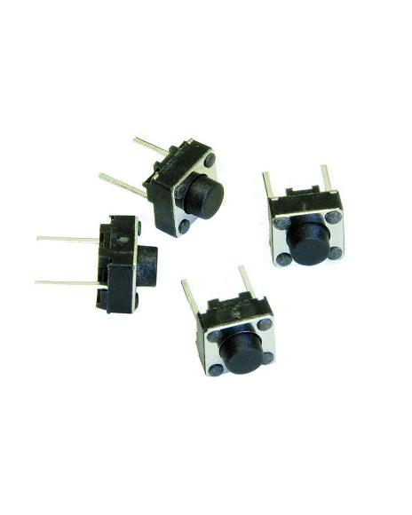
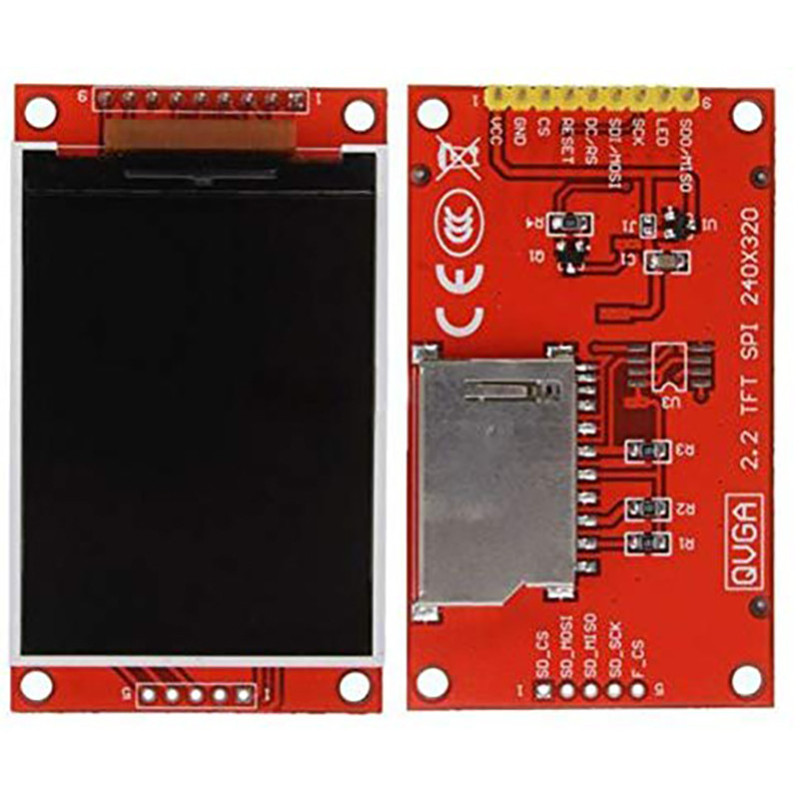
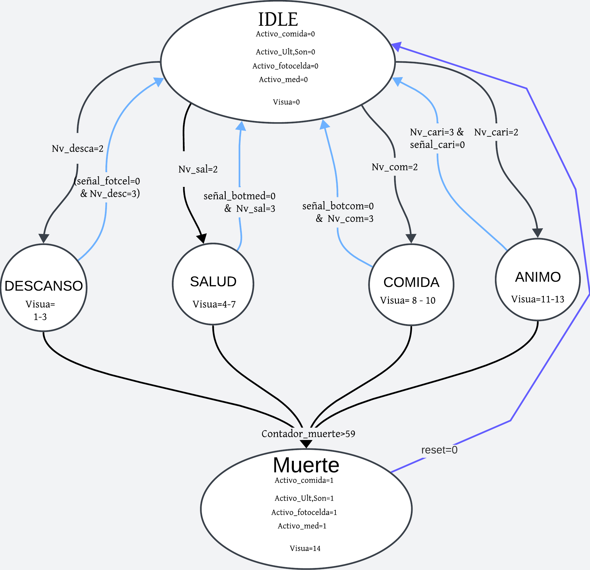
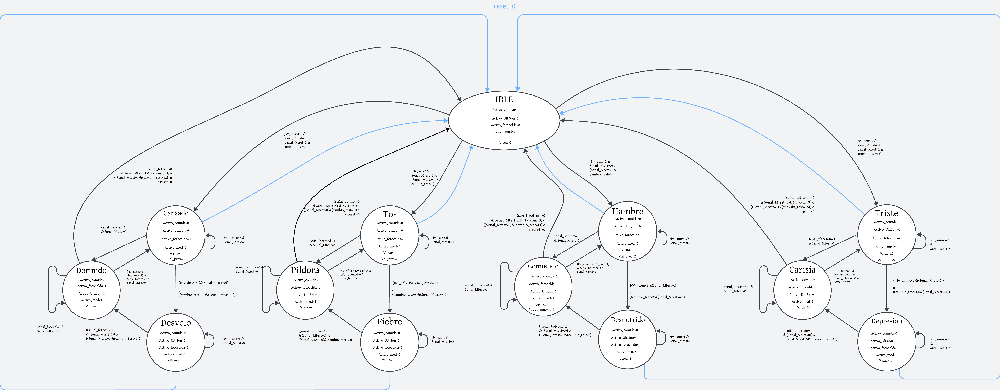

# Entrega 1 del proyecto WP01
- Stewart Andres Antolinez Zapata `santolinez@unal.edu.co` 
- Natalia Andrea Dueñas Salamanca `nduenass@unal.edu.co`
- Juan Diego Saenz Ardila `jsaenza@unal.edu.co` 

## Componentes de Interacción
**Botones**
* `Reset`: Para restablecer el Tamagotchi a un estado inicial conocido, simplemente mantén pulsado el botón durante al menos 5 segundos. Este estado inicial simula el despertar de la mascota con salud óptima. El botón necesario para realizar esta acción se encuentra en la tarjeta de desarrollo de la FPGA.

* `Test`: Activa el modo de prueba al mantener pulsado por al menos 5 segundos, permitiendo al usuario navegar entre los diferentes estados del Tamagotchi con cada pulsación. Este sera un boton de la tarjeta de desarrollo de la FPGA.

* `Boton_Comida`: al presionar el botón destinado para cuidar la alimentación del tamagotchi. Cada vez que lo hagas, el nivel de comida aumentará en 1 (si no está en el nivel máximo). Además, durante los siguientes 5 segundos, verás una visualización especial: si tu Tamagotchi está hambriento o desnutrido, aparecerá una imagen que representa que está comiendo.

* `Boton_Medicina`: al presionar el botón destinado para cuidar la salud del tamagotchi. Cada vez que lo hagas, el nivel de salud aumentará en 1 (si no está en el nivel máximo). Además, durante los siguientes 5 segundos, verás una visualización especial: si tu Tamagotchi está en los estados de tos o fiebre, aparecerá una imagen que representa que está recibiendo una píldora para mejorar su salud. 

**Sensores**
* `Sensor Ultra sonido`: Utiliza el sensor de ultrasonido HC-SR04. Cuando este sensor detecte algo a una distancia menor a un umbral determinado, aumentará el nivel de ánimo de tu mascota virtual. Además, durante el tiempo en que el sensor esté activo y detectando objetos cercanos, verás una visualización específica en la pantalla. Pero eso no es todo: si tu Tamagotchi se encuentra en los estados de tristeza o depresión, cuando la señal del sensor sea 1, verás una imagen que representa a tu Tamagotchi recibiendo cariño. Si esta señal persiste durante 15 segundos o más, el nivel de cariño subirá en 1 (a menos que ya esté en el nivel máximo).

](Imagenes/Working-of-HC-SR04-Ultrasonic-Sensor-1024x394.jpg)

](Imagenes/ww-PINES.jpg)

* `Sensor de Luz`: cuando este sensor detecte sombra o una determinada ausencia de luz aumenta el nivel de decanso, y durante el tiempo que que el sensor este registrando esa ausencia de luz este mostrara una visualización determinada para ese caso. Modulo Sensor De Luz Con Ldr Fotoresistor.

## Componentes de Visualización

* `Pantalla ILI9341`: 
El componente ILI9341 es una pantalla TFT que se utiliza en el proyecto para mostrar los distintos estados del Tamagotchi. Cada vez que el Tamagotchi cambia de estado, la pantalla ILI9341 actualiza su visualización para reflejar estos cambios, proporcionando una interfaz gráfica interactiva que mejora la experiencia del usuario con el juego. Esta visualización dinámica permite a los jugadores observar el estado actual del Tamagotchi, facilitando una interacción más inmersiva y efectiva con el juego.

# Tamagotchi

## Caja Negra

## Maquina de Estados

La maquina de estados finitos parte desde un estado IDLE donde recibe información de todos los sensores. Si uno de los Niveles baja a 2 va al estado de este nivel, es necesario aclarar que estos estados tienen 3 estados internos que seran explicados en la maquina de estados finitos visto de una forma más especifica (según el estado el parametró de visualización que sera entregado) , la única forma de salir es volviendo al Nivel 3 por medio de los sensores o utilizando el boton reset ( o el boton test como se vera a continuación) . Si el nivel en uno de los 4 estados internos permanece en 0 durante más de 59 segundos, este morira siendo el boton reset la única forma de volver. 

Observando cada uno de los estados generales se compone de 3 estados, uno transitorio que se activa al utilizar el sensor de ese respectivo estado, y los otros 2 dependientes del nivel, en el estado donde el Nivel es 0, se activa el contador muerte. El contador retornara a 0, de presiona de estar en uno de los estados transitorios. Es importante aclarar que en el caso de animo y sueño si se puede devolver al peor estado, esto es porque funcionan con sensores y no con botones.

En esta forma especifica se muestra que el boton test también controla el comportamiento, este se mueve entre cada uno de los estados internos para después volver a IDLE, por medio del registro Val_prev cambiara a otros 3 estados distintos al ser presionado.
## Diagramas de caja negra de los componentes y maquinas de Estado

### Ultra Sonido

Como se puede observar en el diagrama de la caja negra, el módulo del sensor tiene como entradas Enable, clk, Echo, y como salidas Trigger, Done y Led. Dentro de la caja, se encuentran bloques internos que desempeñan funciones específicas, tales como Trigger, Echo y Tiempo.

En la caja de Trigger, se utiliza la señal de reloj (clk) y la señal de habilitación (Enable) para realizar un conteo en cada flanco de subida del pulso. Mientras el contador alcanza un valor de 10, el Trigger está activado. Luego, cuando el contador supera el valor de 10, el Trigger se desactiva y permanece así hasta que el contador alcanza el valor de 23333, que representa el mayor tiempo posible de medición. Este valor se calcula en base a la distancia máxima posible, que es de 400 cm.

La ecuación utilizada para calcular este tiempo máximo es: T=cm×0.01715. Una vez que el contador alcanza este valor, vuelve a cero para iniciar un nuevo ciclo de medición.

En la caja de Echo, se utiliza la señal de reloj (clk) y la señal de retorno del eco (Echo). En cada flanco de subida del pulso de reloj, si Echo está activo, se suma 1 al contador de Tiempo. Mientras Echo esté activo, la señal de Done permanece en 0, indicando que la medición está en curso. Cuando la señal de Echo finaliza, Done cambia a 1 y el contador de Tiempo se reinicia a 0.

En la caja de Tiempo, la salida del contador Tiempo del bloque Echo se compara con el valor de 583. Esta comparación se realiza porque ese es el tiempo en el que se determina que la medición es válida si se reemplaza la ecuación T = cm * 0.01715 por 10. Si el valor de Tiempo está en el rango de 0 a 583, el LED se enciende, indicando que la distancia medida está dentro del rango aceptable.

### Modos

Los modos poseen 2 cosas de manera esencial que va con un objetivo de definir el comportamiento de la salida *Nivel* la cual corresponde a la **Caja negra** de `Modo_Primitivo`, la cual posee un *activo* que permitira que ese modo suba o baje de *Nivel*, por otro lado junto al *clk* permitira que despues de un determinado tiempo el modo baje de *Nivel* de uno en uno mientras que gracias a *Entrada_Sube_Nivel* como su nombre lo indica aumenta el *Nivel* de uno en uno siempre y cuando no se encuentre en el *Nivel* maximo.

Esta parte convergen bastantes compornentes debido a que `Modos` utiliza otras cajas negras adicionales las cuales son `Botones_antirrebote` y `Modo_Primitivo` que permitiran unir el funcinamiento de los botones, los sensores y que estos cumplan la funcinalidad para subir el nivel, pero que en tal caso que no se utilicen bajen el nivel, y esto ya se cumple para todos los modos que pasa el tamagotchi, tal y como se aprecia tanto en las entradas y salidas de la caja negra de `Modos`.

### Botones

La **Caja negra** que lleva por nombre `Boton_AR` se debe a que es la encargada de filtrar el ruido que envia un boton al ser pulsado, esto se logra gracias a que una vez se pulse el boton este debe permanecer pulsado un determinado tiempo, el cual se logra gracias al *clk*, para asi despues de tener un determinado tiempo pulsado la entrada *Boton_In* cambie el estado de la salida *Boton_Out*.

Utilizando lo realizado en `Boton_AR` se logra filtrar todo el ruido que tienen todos los botones que se emplearan como lo son el *B_Reset*, *B_Test*, *B_Energia* y *B_Medicina*, con lo cual para los botones *B_Reset* y *B_Test* basta con cambiar un parametro para que se envie el registro de su respectiva señal (*Senal_Reset* y *Senal_Test*) asi como se indica en el funcionamiento del componente, por otro lado las señales de los botones que ya involucran los modos del **`tamagorchi`** pasan de señal de entrada a una de salida en un tiempo mas inmediato.

### ILI9341

**SPI master:** En esta "caja negra" se implementa el protocolo SPI, generando las señales necesarias para el funcionamiento del ILI9341. `spi_mosi`es la señal por la cual se envían los datos bit a bit. `spi_sck` genera los pulsos de reloj que sincronizan el envío de datos por MOSI; cada bit de dato corresponde a un pulso de reloj, y en este caso, se envían datos de 16 bits, lo que requiere 16 pulsos. `spi_cs` selecciona al esclavo específico con el que se desea comunicar, ya que SPI es una configuración maestro-esclavo que puede manejar varios esclavos; en este caso, `spi_cs`  se activa cuando se quiere utilizar la pantalla. Por último, `spi_dc` indica si los bits enviados por MOSI son datos (`spi_cs = 1`) o comandos (`spi_cs = 0`). La entrada `input_data` es de 9 bits, donde el bit más significativo indica si es un comando o un dato, y los 8 bits restantes representan el contenido. `available_data` indica la disponibilidad de datos para enviar, mientras que `idle` muestra si el sistema está inactivo, proporcionando retroalimentación para sincronizar la generación de los pulsos de reloj en `spi_sck` y el envío de datos.

**Controlador:** La caja negra del controlador contiene internamente el SPI master, que es el encargado de controlar qué datos se envían a la pantalla. Por esta razón, se utiliza una máquina de estados dentro del controlador, ya que su operación requiere varias etapas.

El estado inicial es `START`, que cambia inmediatamente a `SEND_INIT` a menos que haya una señal de `rst`. Los estados `SEND_INIT` (primer comando para reiniciar la pantalla), `SEND_CONFIG` (una lista de 84 comandos a ejecutar guardados en `INIT_SEQ_LEN`), `DISPLAY_ON` (configuración para encender la pantalla), `SET_ROTATION` (configuración para la rotación de la pantalla) y `SET_ADDRESS` (configuración para establecer la dirección del píxel) se utilizan para configurar inicialmente la pantalla. En todos estos estados, `available_data = 1`, indicando que hay datos disponibles para enviar.

En el estado `FRAME_LOOP`, como su nombre lo indica, se realiza un bucle por cada pixel (76800) recibir los 16 bits en `input_data`. Durante el ciclo positivo del reloj `dataclk`, se envían al SPI master los 8 bits más significativos, y durante el ciclo negativo, los 8 bits menos significativos. Estos 8 bits se concatenan con un bit de valor 1 en el bit más significativo, ya que siempre se están enviando datos, lo que hace que `input_data` sea de 9 bits. Cuando se recibe la señal `frame_done` (es decir, se han leído todos los píxeles), la FSM transita a `WAIT_FRAME`. Si se cambia la imagen, se sale de `WAIT_FRAME` y se regresa a `FRAME_LOOP`. Por último, en todos los estados de `WAIT`, `available_data` es 0, ya que no hay datos para enviar en esos momentos.

**Top ILI9341**
En esta sección se observan tres módulos internos. El primero es un divisor de frecuencia que reduce la frecuencia del reloj de la FPGA de 50 MHz a 20 MHz, para que sea compatible con los demás módulos internos. Luego, la caja de lectura y envío de memoria se encarga de leer un archivo `.txt` de 76800 líneas, donde cada línea contiene el color RGB de un píxel, escrito en formato hexadecimal de 16 bits. Este módulo recorre cada línea y envía el valor correspondiente al controlador a través de la salida `current_pixel`. Cada valor se transmite en respuesta a un flanco de subida de la señal `data_clk`. Un contador se utiliza para verificar que se hayan procesado los 76800 píxeles y, al finalizar, se envía la señal `frame_done`. Por último, las salidas de este módulo se conectan a la pantalla, permitiendo la visualización de los datos en ella.
