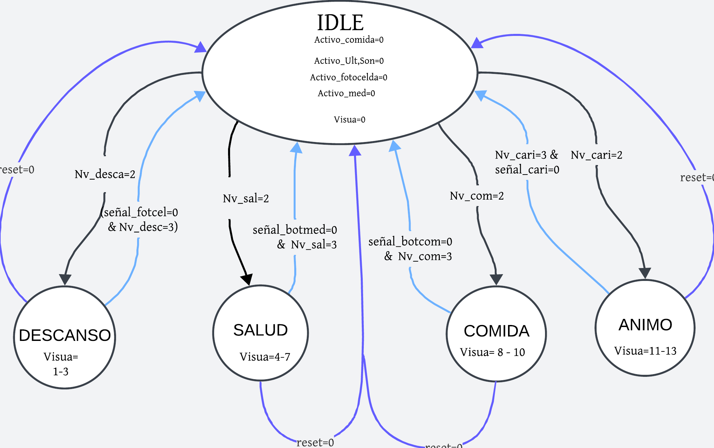
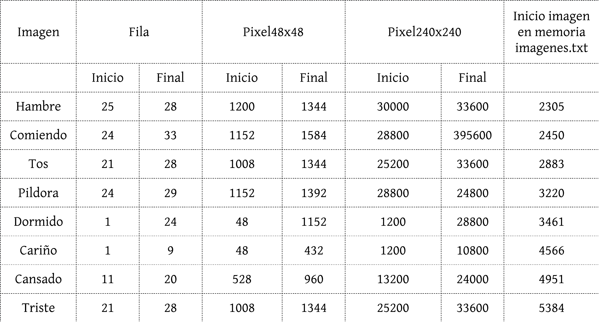

# Entrega 1 del proyecto WP01
- Stewart Andres Antolinez Zapata `santolinez@unal.edu.co` 
- Natalia Andrea Dueñas Salamanca `nduenass@unal.edu.co`
- Juan Diego Saenz Ardila `jsaenza@unal.edu.co` 

## Componentes de Interacción
**Botones**
* `Reset`: Para restablecer el Tamagotchi a un estado inicial conocido, simplemente mantén pulsado el botón durante al menos 5 segundos. Este estado inicial simula el despertar de la mascota con salud óptima. El botón necesario para realizar esta acción se encuentra en la tarjeta de desarrollo de la FPGA.

* `Test`: Activa el modo de prueba al mantener pulsado por al menos 5 segundos, permitiendo al usuario navegar entre los diferentes estados del Tamagotchi con cada pulsación. Este sera un boton de la tarjeta de desarrollo de la FPGA.

* `Boton_Comida`: al presionar el botón destinado para cuidar la alimentación del tamagotchi. Cada vez que lo hagas, el nivel de comida aumentará en 1 (si no está en el nivel máximo). Además, durante los siguientes 5 segundos, verás una visualización especial: si tu Tamagotchi está hambriento o desnutrido, aparecerá una imagen que representa que está comiendo.

* `Boton_Medicina`: al presionar el botón destinado para cuidar la salud del tamagotchi. Cada vez que lo hagas, el nivel de salud aumentará en 1 (si no está en el nivel máximo). Además, durante los siguientes 5 segundos, verás una visualización especial: si tu Tamagotchi está en los estados de tos o fiebre, aparecerá una imagen que representa que está recibiendo una píldora para mejorar su salud. 

**Sensores**
* `Sensor Ultra sonido`: Utiliza el sensor de ultrasonido HC-SR04. Cuando este sensor detecte algo a una distancia menor a un umbral determinado, aumentará el nivel de ánimo de tu mascota virtual. Además, durante el tiempo en que el sensor esté activo y detectando objetos cercanos, verás una visualización específica en la pantalla. Pero eso no es todo: si tu Tamagotchi se encuentra en los estados de tristeza o depresión, cuando la señal del sensor sea 1, verás una imagen que representa a tu Tamagotchi recibiendo cariño. Si esta señal persiste durante 15 segundos o más, el nivel de cariño subirá en 1 (a menos que ya esté en el nivel máximo).

](Imagenes/Working-of-HC-SR04-Ultrasonic-Sensor-1024x394.jpg)

](Imagenes/ww-PINES.jpg)

* `Sensor de Luz`: cuando este sensor detecte sombra o una determinada ausencia de luz aumenta el nivel de decanso, y durante el tiempo que que el sensor este registrando esa ausencia de luz este mostrara una visualización determinada para ese caso. Modulo Sensor De Luz Con Ldr Fotoresistor.

## Componentes de Visualización

* `Pantalla ILI9341`: 
El componente ILI9341 es una pantalla TFT que se utiliza en el proyecto para mostrar los distintos estados del Tamagotchi. Cada vez que el Tamagotchi cambia de estado, la pantalla ILI9341 actualiza su visualización para reflejar estos cambios, proporcionando una interfaz gráfica interactiva que mejora la experiencia del usuario con el juego. Esta visualización dinámica permite a los jugadores observar el estado actual del Tamagotchi, facilitando una interacción más inmersiva y efectiva con el juego.

# Tamagotchi

# Caja Negra

# Maquina de Estados

La maquina de estados finitos parte desde un estado IDLE donde recibe información de todos los sensores y botones . Si el nivel de cualquier modo baja a 2 va al estado de este nivel (el orden de prioridad es: comida, salud, descanso y animo) . Es necesario aclarar que estos estados tienen 3 estados internos que seran explicados en la maquina de estados finitos visto de una forma más detallada (según el estado el parametró de visualización que sera entregado). La única forma de volver a IDLE sin el reset o el test, es volviendo a tener un nivel igual a 3 en ese estado. 

Observando cada uno de los estados generales se compone de 3 estados, uno transitorio que se activa al utilizar el sensor o boton de ese respectivo estado, y los otros 2 dependientes del nivel, en el estado donde el Nivel es 0 se tenia considerada visualización distinta, sin embargo, debido a los recursos de la FPGA esta opción fue descartada. Cada estado transitorio se mantendrá durante 5 segundos, para luego cambiar al estado correspondiente segun el nuevo nivel.

En esta forma especifica se muestra que el boton test también controla el comportamiento, este se mueve entre cada uno de los estados internos para después volver a IDLE, por medio del registro cambio_test cambiara a otros 3 estados distintos al ser presionado, esto si previamente ya se ha activado el modo test, pulsandolo por 5 segundos.
# Diagramas de caja negra de los componentes y maquinas de Estado

## Ultra Sonido

En el diagrama de la caja negra, se observa el módulo del sensor con las entradas `Enable`, `clk`, `Echo` y las salidas `Trigger`, `Done` y `Led`. Este sistema se ha diseñado para detectar objetos mediante ultrasonido. Originalmente, en la caja de Trigger, el contador incrementaba con el reloj (clk) mientras la señal Trigger estaba activada por un tiempo determinado (hasta un valor de 10), y luego se desactivaba tras alcanzar un valor máximo basado en la distancia calculada de 400 cm. En la caja de Echo, el sistema medía cuánto tiempo estaba activa la señal `Echo` y, cuando esta terminaba, la señal Done indicaba el fin de la medición.

Sin embargo, el sistema no esperaba que el eco retornara antes de volver a enviar una nueva señal de Trigger, lo que generaba problemas de sincronización. Para mejorar este comportamiento, se decidió implementar una máquina de estados, permitiendo una mejor coordinación entre las señales Trigger y Echo. Con la máquina de estados, se asegura que el sistema espere correctamente a que el eco regrese antes de iniciar un nuevo ciclo de medición, mejorando la precisión en la detección de objetos.

El sistema de ultrasonido comienza en el estado IDLE. Desde allí, pasa directamente al estado TRIGGER, donde se realiza un conteo en cada flanco de subida del reloj. Mientras el contador alcanza un valor de 10, la salida Trigger se mantiene activada. Después de pasar 10 microsegundos, el contador se resetea y se establece trigger_done = 1, lo que provoca que el sistema avance al estado WAIT.

En el estado WAIT, el sistema espera recibir la señal de entrada `Echo`. Si `Echo = 1`, pasa al estado WAITECHO, donde se mide cuántos pulsos de reloj permanece activa la señal `Echo`, almacenando este valor en la variable Tiempo. Si el valor de Tiempo es menor que 1000 (pulsos de reloj), se activa el LED, lo que indica que se ha detectado un objeto a menos de 20 cm, según la ecuación:

Cuando la señal `Echo` se apaga, el sistema regresa al estado IDLE, y el ciclo se repite.

## Modos

Los modos poseen 2 cosas de manera esencial que va con un objetivo de definir el comportamiento de la salida *Nivel* la cual corresponde a la **Caja negra** de `Modo_Primitivo`, la cual posee un *activo* que permitira que ese modo suba o baje de *Nivel*, por otro lado junto al *clk* permitira que despues de un determinado tiempo el modo baje de *Nivel* de uno en uno mientras que gracias a *Entrada_Sube_Nivel* como su nombre lo indica aumenta el *Nivel* de uno en uno siempre y cuando no se encuentre en el *Nivel* maximo.

Esta parte convergen bastantes compornentes debido a que `Modos` utiliza otras cajas negras adicionales las cuales son `Botones_antirrebote` y `Modo_Primitivo` que permitiran unir el funcinamiento de los botones, los sensores y que estos cumplan la funcinalidad para subir el nivel, pero que en tal caso que no se utilicen bajen el nivel, y esto ya se cumple para todos los modos que pasa el tamagotchi, tal y como se aprecia tanto en las entradas y salidas de la caja negra de `Modos`.

## Botones

La **Caja negra** que lleva por nombre `Boton_AR` se debe a que es la encargada de filtrar el ruido que envia un boton al ser pulsado, esto se logra gracias a que una vez se pulse el boton este debe permanecer pulsado un determinado tiempo, el cual se logra gracias al *clk*, para asi despues de tener un determinado tiempo pulsado la entrada *Boton_In* cambie el estado de la salida *Boton_Out*.

Utilizando lo realizado en `Boton_AR` se logra filtrar todo el ruido que tienen todos los botones que se emplearan como lo son el *B_Reset*, *B_Test*, *B_Energia* y *B_Medicina*, con lo cual para los botones *B_Reset* y *B_Test* basta con cambiar un parametro para que se envie el registro de su respectiva señal (*Senal_Reset* y *Senal_Test*) asi como se indica en el funcionamiento del componente, por otro lado las señales de los botones que ya involucran los modos del **`tamagorchi`** pasan de señal de entrada a una de salida en un tiempo mas inmediato.

## ILI9341

### SPI master:
 En esta "caja negra" se implementa el protocolo SPI, generando las señales necesarias para el funcionamiento del ILI9341. `spi_mosi`es la señal por la cual se envían los datos bit a bit. `spi_sck` genera los pulsos de reloj que sincronizan el envío de datos por MOSI; cada bit de dato corresponde a un pulso de reloj, y en este caso, se envían datos de 16 bits, lo que requiere 16 pulsos. `spi_cs` selecciona al esclavo específico con el que se desea comunicar, ya que SPI es una configuración maestro-esclavo que puede manejar varios esclavos; en este caso, `spi_cs`  se activa cuando se quiere utilizar la pantalla. Por último, `spi_dc` indica si los bits enviados por MOSI son datos (`spi_cs = 1`) o comandos (`spi_cs = 0`). La entrada `input_data` es de 9 bits, donde el bit más significativo indica si es un comando o un dato, y los 8 bits restantes representan el contenido. `available_data` indica la disponibilidad de datos para enviar, mientras que `idle` muestra si el sistema está inactivo, proporcionando retroalimentación para sincronizar la generación de los pulsos de reloj en `spi_sck` y el envío de datos.

### Controlador: 
La caja negra del controlador contiene internamente el SPI master, que es el encargado de controlar qué datos se envían a la pantalla. Por esta razón, se utiliza una máquina de estados dentro del controlador, ya que su operación requiere varias etapas.

El estado inicial es `START`, que cambia inmediatamente a `SEND_INIT` a menos que haya una señal de `rst`. Los estados `SEND_INIT` (primer comando para reiniciar la pantalla), `SEND_CONFIG` (una lista de 84 comandos a ejecutar guardados en `INIT_SEQ_LEN`), `DISPLAY_ON` (configuración para encender la pantalla), `SET_ROTATION` (configuración para la rotación de la pantalla) y `SET_ADDRESS` (configuración para establecer la dirección del píxel) se utilizan para configurar inicialmente la pantalla. En todos estos estados, `available_data = 1`, indicando que hay datos disponibles para enviar.

En el estado `FRAME_LOOP`, como su nombre lo indica, se realiza un bucle por cada pixel al recibir los 16 bits en `input_data`. Durante el ciclo positivo del reloj `dataclk`, se envían al SPI master los 8 bits más significativos, y durante el ciclo negativo, los 8 bits menos significativos. Estos 8 bits se concatenan con un bit de valor 1 en el bit más significativo, ya que siempre se están enviando datos, lo que hace que `input_data` sea de 9 bits. Cuando se recibe la señal `frame_done` (es decir, se han leído todos los píxeles), la FSM transita a `WAIT_FRAME`. Si se cambia la imagen, se sale de `WAIT_FRAME` y se regresa a `FRAME_LOOP`. Por último, en todos los estados de `WAIT`, `available_data` es 0, ya que no hay datos para enviar en esos momentos.

### Top ILI9341
En esta sección se observan tres módulos internos. El primero es un divisor de frecuencia que reduce la frecuencia del reloj de la FPGA de 50 MHz a 20 MHz, para que sea compatible con los demás módulos internos. Luego, la caja de lectura y envío de memoria se encarga de leer un archivo `.txt` de 5720 líneas, donde cada línea contiene el color RGB de un píxel, escrito en formato hexadecimal de 16 bits. 

**Leer y enviar memoria**
Este módulo carga el contenido de un archivo  .txt en la memoria interna del sistema. Para optimizar el uso de la memoria y permitir el cambio entre imágenes, se aplica un escalado, transformando una imagen de 48x48 píxeles a una de 240x240 píxeles.

**Escalamiento:** Se realiza haciendo que cada píxel de la imagen original de 48x48 represente un bloque de 5x5 píxeles en la pantalla. Para lograr esto, se utilizan dos contadores:`counter_horizontal` y `counter_vertical` eEstos se suman y nos dan el valor de la posición del píxel en la cuadrícula de 240x240 que se está escribiendo en la pantalla, es decir,  `pixelactual`. Mientras se calcula `pixel_memoria` on estos mismos contadores para conocer el valor de la posición de `pixelactual` en la cuadrada 48x48. en la cuadrícula de 48x48. Esto se hace dividiendo los contadores, que llegan hasta 240, entre 5 para que ahora su valor máximo sea 48.
Es importante mencionar que esta división busca el valor entero inferior, es decir, por ejemplo, que 1/5 = 0, lo que permite que varios píxeles de la pantalla correspondan a un solo píxel en memoria.
La división del `counter_vertical` se multiplica por 48 para que, por cada fila (de 48 píxeles), se le sume el valor del `counter horizontal`. 

Después de haber definido `pixel_memoria` se lee el valor del píxel en `pixel_data_mem`  en la poscisión `pixel_memoria`, donde por cada pixel 1x1 definido en  `pixel_data_mem[pixel_memoria]` se van a escribir 5x5 en la pantalla.

**Transición imagenes:** 
Todas las imágenes del Tamagotchi son bastante similares, y solo hay pequeñas secciones donde varían en comparación con la imagen IDLE. La imagen IDLE tiene un desplazamiento (offset) de 0, ya que comienza en la posición 0 de la memoria. Las demás imágenes están almacenadas a partir de la posición 2304, que es donde termina la imagen IDLE en la memoria.

Para cambiar entre las imágenes, se utiliza el concepto de "offset". La transición comienza dibujando la imagen IDLE en la pantalla. Sin embargo, cuando `pixelactual` aalcanza la línea donde la imagen debe cambiar, el offset se ajusta. El valor del offset se calcula como la diferencia entre la posición de inicio de la nueva imagen y el valor de  `pixelactual` en la cuadricula 48x48.

Para la implementación, se pasó cada imagen a formato RGB mediante un código en Python llamado convert2pixels, que escribe cada imagen en un archivo .txt. En cada archivo .txt de las imágenes, se copian los píxeles desde donde comienza el cambio hasta donde termina. Para saber qué línea representa un píxel específico, se utiliza la siguiente ecuación:

Luego esto se pega en `Imagenes.txt`que es la memoria que esta leyendo la FPGA. Para implementarlo en el proyecto se hizo la siguiente tabla.

De esta manera, al momento de realizar el cambio de imagen, el valor de `pixel_memoria` se ajusta para apuntar a la línea donde se definió la nueva imagen. Una vez que se completa la escritura de la línea modificada, el offset vuelve a 0, y el resto de la imagen sigue mostrándose con los datos de IDLE. Este enfoque fue diseñado para optimizar el uso de la memoria en la FPGA, minimizando el espacio necesario para almacenar las imágenes.